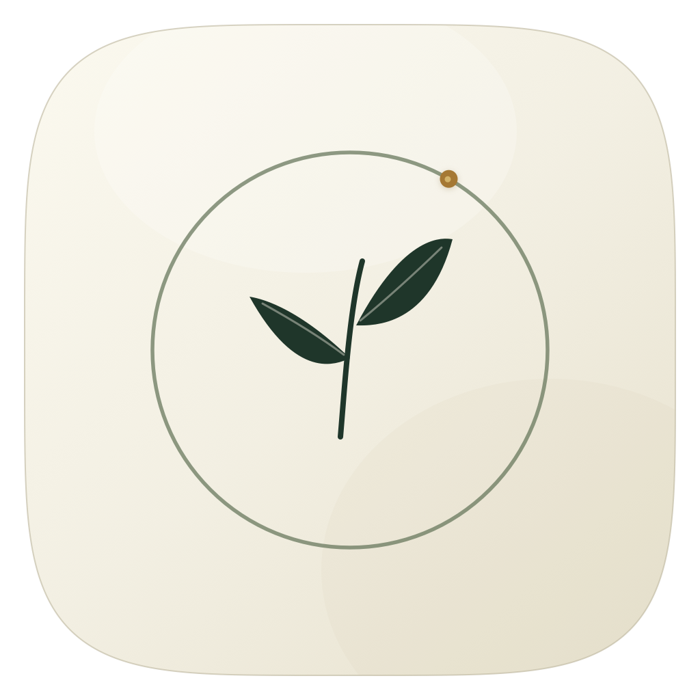

<div align="center">
  
  <h1>Still</h1>
  <p>A tiny, quiet macOS focus timer.</p>
</div>

## Out of your way

A native SwiftUI + AppKit companion that sits lightly above your desktop.
**128 × 52 points** by default. Just the countdown: clear minutes and smaller,
softer seconds on a translucent surface. No accounts, analytics, or network requests.

- **Click to expand.** Choose 30, 45, or 60 minutes and the controls disappear again.
  Use the pencil to edit all three shortcuts in Preferences.
- **A little sense of time.** A fine sage progress line fills as the session elapses; it dims when paused.
- **Gentle motion.** The panel opens around the countdown, with a soft control reveal.
  Rapid reversals stay smooth, and macOS Reduce Motion is respected.
- **Quiet while you work.** Click the desktop or press Esc to collapse. Hovering
  does not open anything. Drag the digits to move the timer.
- **Adjustable.** Scale the compact timer from 80% to 300% (up to 384 × 156 points)
  and change background opacity in Preferences.
- **Follows your Mac.** System light/dark mode by default, with manual overrides.
- **Your sessions, in Markdown.** Pick an existing `.md` file or a new path. Still
  appends completed focus sessions, preserving your notes and avoiding duplicates.
- **Gentle endings.** Local notifications and an original soft two-note chime.
- **A little perspective.** An expanded-only thought, with a quiet button for the next one.
  Edit your own local collection; thoughts stay still until you choose another.
- **Reliable timing.** Pause/resume, sleep/wake, and relaunch use absolute deadlines.
  Breaks and unfinished intervals never count as focus sessions.

## Build and run

macOS 14+ and Swift 6 (Xcode or Command Line Tools). No third-party dependencies.

```sh
git clone https://github.com/onjas-6/still-pomodoro.git
cd still-pomodoro
./scripts/build.sh
open build/Still.app
```

Open `Package.swift` in Xcode to develop. Run the bundled `.app` so macOS can identify
it for notifications. Builds are ad-hoc signed for local use. Public trusted binary
releases need Developer ID signing and notarization; set `CODE_SIGN_IDENTITY` to use
your own identity. `STILL_BUILD_PATH` optionally places build artifacts elsewhere.

## Use

1. Click the small countdown, then **30 min**, **45 min**, or **60 min** to start.
2. Click it again to pause, continue, reset, start a break, or open preferences.
3. In Preferences, choose **System / Light / Dark**, timer size, and background opacity.
   Type directly into the focus and break duration fields. **Start buttons** controls
   the three shortcuts; press Return or leave the field to save. Focus durations accept
   1–180 minutes. Changes apply to future sessions and preserve the active countdown.
4. Under **Markdown journal**, enter a path and click **Save path**, or choose a file.
   Use **Open Markdown** to see the actual record in your editor.

After quitting Still, you can also set the path from a terminal:
`./build/Still.app/Contents/MacOS/Still --journal /path/to/focus-sessions.md`.

The menu-bar leaf can show or hide the timer, open history, or quit. Hidden timers
keep running. Quitting leaves an already-scheduled notification intact; a completed
session is reconciled on the next launch. Notifications and sounds respect macOS
Focus and notification settings; a sleeping Mac cannot play audio until wake/delivery.

## Your data

The default journal destination is `~/Documents/Still-sessions.md`. You can place
it anywhere writable, including your own notes folder. Existing Markdown content is
preserved. Each entry includes a readable local timestamp, timezone, duration, and
an invisible session identifier for reliable synchronization.

A small recovery cache at `~/Library/Application Support/Still/state.json` keeps the
active timer, preferences, and sessions so a failed Markdown write does not lose your
work. Journal reads and writes run in the background, so a slow or unavailable notes
folder never pauses the timer or blocks the window. The app shows write errors and retries on launch or when the path is saved
again. Changing the journal path preserves existing contents and carries your session
history into the selected file. Keep hidden Still metadata comments if you edit the
journal, so the app can recognize entries and avoid duplicating them.

Window position lives in macOS app preferences. No data leaves your Mac through Still.
Any cloud synchronization is controlled by the folder you choose.

### Personal reminders

The expanded panel has room for a short thought. Use the arrow to advance; there is
no automatic carousel. The collapsed timer stays the same size.

Choose **Preferences → Inspiration → Edit phrases…** to open
`~/Library/Application Support/Still/inspiration.json` in TextEdit. Save your edits,
then reopen the timer controls to reload. An example collection is created on first edit:

```json
{
  "version": 1,
  "phrases": [
    { "id": "begin", "text": "Give the next small step your attention.", "source": "My notes" }
  ]
}
```

Use unique IDs and short text (up to 120 characters, at most 100 entries). `source`
is an optional short caption. Longer text can be shortened on screen; two brief lines
fit best. Invalid edits keep the last loaded collection and show a message in Preferences.
The app reads this single local file in the background. It does not scan your notes or
send them anywhere. The public repository contains only generic examples; your personal
collection and its sources belong outside the source checkout.

## Development

```sh
./scripts/test.sh                              # timer core, including CLT-only Macs
./scripts/test-journal.sh                      # Markdown preservation and round-trip checks
./scripts/test-inspiration.sh                  # local phrase format and validation
swift test                                    # XCTest, with full Xcode
./scripts/build.sh
./build/Still.app/Contents/MacOS/Still --self-test  # isolated persistence checks
```

- `Sources/StillCore` — timer state machine, sessions, Markdown journal.
- `Sources/Still` — compact panel, controls, preferences, notifications, recovery cache.
- `scripts/generate-assets.swift` — reproducible original icon and chime.

Tests use temporary data. On a logged-in Mac, also run
`./build/Still.app/Contents/MacOS/Still --window-self-test` to check repeated resizing
and expanding/collapsing against a real native window. This opens an isolated preview
and does not change your timer, journal, or saved window position.

To regenerate assets, run `swift scripts/generate-assets.swift`.

## Design references

Still’s visual direction draws on [Things](https://culturedcode.com/things/blog/2025/09/things-for-os-26/)
for restrained glass, curvature, spacing, and tactile controls;
[Raycast Focus](https://www.raycast.com/core-features/focus) for a glanceable floating timer;
and [Session](https://www.stayinsession.com/) for a focused timer hierarchy.
Still keeps its own ivory, mineral green, and muted sage palette. The timer remains
one persistent view during expansion; the fine progress line stays secondary to the time.

## License

[MIT](LICENSE). Made by [Jason Hu](https://github.com/onjas-6).
