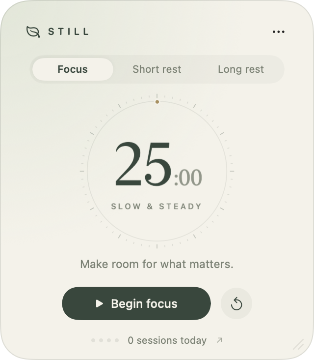

<div align="center">
  
  <h1>Still</h1>
  <p>A little room to focus.</p>
  <p>A quiet, native macOS Pomodoro timer that lives above your work.</p>
</div>

<p align="center"></p>

## Small by design

Still is a resizable floating companion, built with SwiftUI and AppKit. Warm ivory,
sage, and a touch of brass. Large minutes, smaller, softer seconds. No accounts,
analytics, subscriptions, web views, or network requests.

- **A gentle floating timer.** Drag its background to move it; drag the bottom-right
  grip to resize it. Pick a size or turn off “Always on top” in the ··· menu.
- **Your rhythm.** Focus, short rest, and long rest, with adjustable durations.
  Defaults are 25 / 5 / 15 minutes. After every fourth focus session today, the
  next rest offered is a long one. Each interval starts when you choose.
- **A quiet ending.** Native local notifications and an original, soft two-note
  chime. Preview or mute the chime in Preferences.
- **A local record.** Completed focus sessions, minutes focused, a seven-day view,
  and JSON export. Interrupted sessions and breaks do not inflate your count.
- **Three atmospheres.** Sage, Clay, and Dusk.
- **A clock you can trust.** Absolute deadlines preserve timing across sleep and
  relaunch. Pausing preserves the remaining time. Completion is recorded once.

## Build and run

Requires macOS 14 or newer and Swift 6 (Xcode or the Command Line Tools).
There are no third-party dependencies.

```sh
git clone https://github.com/onjas-6/still-pomodoro.git
cd still-pomodoro
./scripts/build.sh
open build/Still.app
```

You can also open `Package.swift` in Xcode to work on the source. Use the bundled
`.app` to run Still: notifications require an application bundle with a stable
identifier. The build script signs locally with an ad-hoc signature; a Developer
ID and notarization are required for a normal trusted public binary release.
Set `CODE_SIGN_IDENTITY` to use your own signing identity.

## Use

1. Click **Begin focus**. Allow notifications when macOS asks.
2. Click **Pause** / **Continue**, or press Space while the timer has keyboard focus.
3. When the timer finishes, click **Take a breath** to start a rest.
4. Click the session count to see your history. Use **··· → Preferences** to change
   duration, color, sound, and floating behavior.

Still also lives in the menu bar. **Hide Still** hides only the floating window;
its timer continues. Open it again from the leaf menu bar icon. Quitting leaves a
running timer’s scheduled system notification intact; the session is recorded the
next time Still opens. Notifications respect macOS notification and Focus settings.
A sleeping Mac does not play a chime until it can deliver the notification or wake.

## Local data

Session history, preferences, and the active timer are stored atomically at:

```text
~/Library/Application Support/Still/state.json
```

Window position and size are stored in the app’s macOS preferences. Use the export
button in Session History for a portable JSON copy. Still makes no network requests.
If saved JSON cannot be read, Still preserves a backup before creating new data.

## Development

```sh
./scripts/test.sh                              # core checks, including CLT-only Macs
swift test                                     # XCTest suite, with full Xcode
./scripts/build.sh
./build/Still.app/Contents/MacOS/Still --self-test  # isolated local persistence checks
```

- `Sources/StillCore` — deterministic timer state machine and session model.
- `Sources/Still` — native windows, SwiftUI views, JSON storage, notifications.
- `scripts/generate-assets.swift` — reproducible original icon and chime.
- `Resources` — app metadata, icon, and PCM audio.

To regenerate the assets, run `swift scripts/generate-assets.swift` from the
repository root. Tests use temporary directories and do not touch your session history.

## License

[MIT](LICENSE). Made by [Jason Hu](https://github.com/onjas-6).
